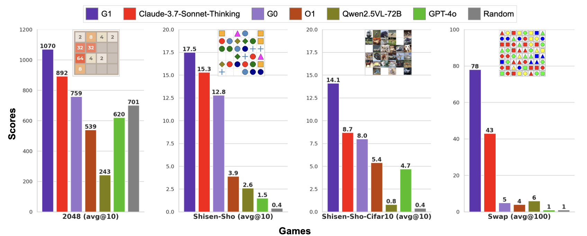
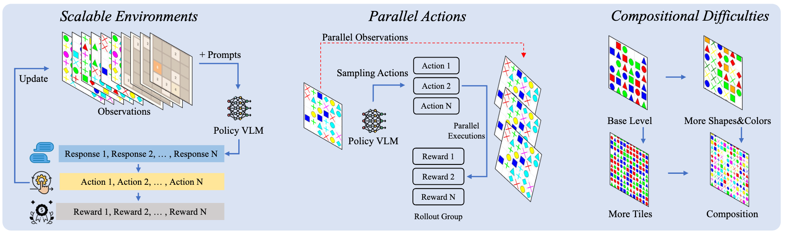
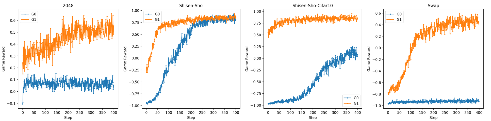
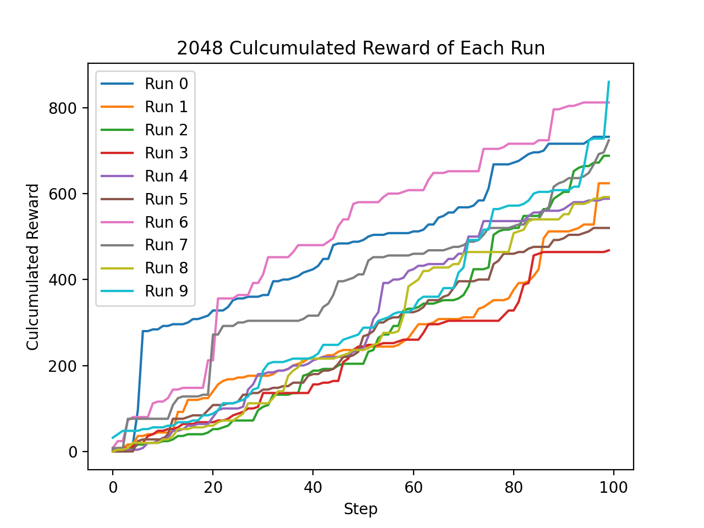

<h1 align="center">G1</h1>

<p align="center">
<a href="https://arxiv.org/abs/2505.13426">
</a>


Source code for paper G1: Bootstrapping Perception and Reasoning Abilities of Vision-Language Model via Reinforcement Learning. This repository includes:

- VLM-Gym: A parallel environment for training/evaluating Vision-Language Models on visual games
- Gaming RL Training: Implementation of reinforcement learning for training G0 and G1 models.


<p align="center">

</p>


https://github.com/user-attachments/assets/0417d12b-5668-4d8c-9c50-ea0de139c93d


<br>

<p align="center">
<i>Features of VLM-Gym</i><br>

</p>

<p align="center">
<i>RL training curves of G0 and G1 models on different games.</i><br>

</p>

## ⚙️ Setup 
```
conda create -n vlmgym python=3.10
conda activate vlmgym
bash setup.sh
```

## 🏃 Run Parallel Enviroment in VLM-Gym

We provide the evaluation scripts of 4 games using a random policy under `./vlmgym/test`. The 2048 enviroment is based on [gymnasium-2048](https://github.com/Quentin18/gymnasium-2048).

``` bash
cd ./vlmgym/test
python eval_2048.py
```

This would generate the evaluation log file and an image summarizing the curves under `./vlmgym/test/logs` dir and the videos documenting all runs under `./vlmgym/test/videos` dir. All different runs are conducted in parallel. 

It is easy to evaluate different models by implementing the ```custom_policy``` function in the evaluation script, such as using OpanAI class or vLLM. 


<p align="center">
<i>Example 10 parallel random 2048 run curves</i><br>

</p>

## 📄 Customize Difficulties in VLM-Gym

The game config are in ```./vlmgym/sandbox/games/```, for example, you can alter the diffculties of Shisen-Sho game by changing the shape and color settings in ```./vlmgym/sandbox/games/gamematch.py```


## 🎯 RL Training using VLM-Gym

We provide the RL scripts utilizing the VLM-Gym under `./training/scripts`. Our training is based on [EasyR1](https://github.com/hiyouga/EasyR1/).

For example, to conduct the RL experiments for Shisen-sho game

```bash
cd training
bash scripts/rl_shisensho.sh

# Verified least GPU requirements is 4x80G GPUs.
```

All rollout histroy would be saved under the EasyR1 directory to watch the learning curve.

After training, you can serve the model using vLLM to conduct evaluations with VLM-Gym.


## 📖 Citation

If you find our work helpful, please kindly cite

```bib
@misc{chen2025g1bootstrappingperceptionreasoning,
      title={G1: Bootstrapping Perception and Reasoning Abilities of Vision-Language Model via Reinforcement Learning}, 
      author={Liang Chen and Hongcheng Gao and Tianyu Liu and Zhiqi Huang and Flood Sung and Xinyu Zhou and Yuxin Wu and Baobao Chang},
      year={2025},
      eprint={2505.13426},
      archivePrefix={arXiv},
      primaryClass={cs.CV},
      url={https://arxiv.org/abs/2505.13426}, 
}
```

